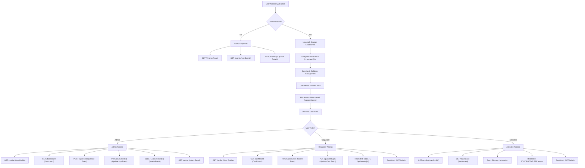

Authentication Authorisation Flow of Mini Nextjs Application "Event Management"

```mermaid
flowchart TD
    %% User entry point
    A[User Access Application]
    A --> B{Authenticated?}

    %% Public endpoints (Unauthenticated users)
    B -- "No" --> C[Public Endpoints]
    C --> C1["GET / (Home Page)"]
    C --> C2["GET /events (List Events)"]
    C --> C3["GET /events/[id] (Event Details)"]

    %% Authentication flow (for authenticated users)
    B -- "Yes" --> D[NextAuth Session Established]
    D --> D1["Configure NextAuth in [...nextauth].js"]
    D1 --> D2["Session & Callback Management"]
    D2 --> D3["User Model includes Role"]
    D3 --> M[Middleware: Role-based Access Control]
    M --> E[Retrieve User Role]

    %% Role-based routing
    E --> F{User Role?}

    %% Admin Role: Full access including admin panel
    F -- "Admin" --> G[Admin Access]
    G --> G1["GET /profile (User Profile)"]
    G --> G2["GET /dashboard (Dashboard)"]
    G --> G3["POST /api/events (Create Event)"]
    G --> G4["PUT /api/events/[id] (Update Any Event)"]
    G --> G5["DELETE /api/events/[id] (Delete Event)"]
    G --> G6["GET /admin (Admin Panel)"]

    %% Organizer Role: Manage own events
    F -- "Organizer" --> H[Organizer Access]
    H --> H1["GET /profile (User Profile)"]
    H --> H2["GET /dashboard (Dashboard)"]
    H --> H3["POST /api/events (Create Event)"]
    H --> H4["PUT /api/events/[id] (Update Own Event)"]
    H --> H5["Restricted: DELETE /api/events/[id]"]
    H --> H6["Restricted: GET /admin"]

    %% Attendee Role: Browse and sign up for events
    F -- "Attendee" --> I[Attendee Access]
    I --> I1["GET /profile (User Profile)"]
    I --> I2["GET /dashboard (Dashboard)"]
    I --> I3[Event Sign-up / Interaction]
    I --> I4["Restricted: POST/PUT/DELETE events"]
    I --> I5["Restricted: GET /admin"]

```
